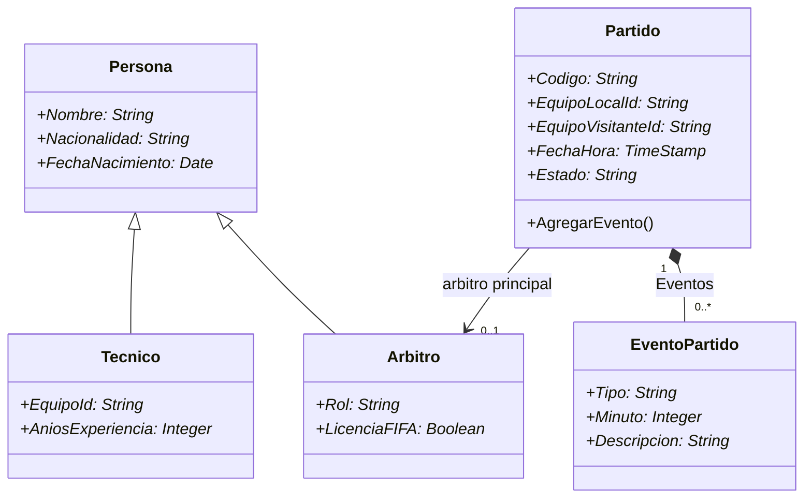

# Diseño del dominio orientado a objetos - Fixture 2030

## 1. Objetivo

El módulo modela la gestión estructural de un partido del Fixture 2030 mediante objetos persistentes de InterSystems IRIS. La solución concentra identidad, estado, relaciones y reglas de integridad dentro de las clases del dominio.

Redis, Cassandra, Neo4j y MongoDB conservan las responsabilidades definidas en los hitos anteriores. IRIS se utiliza para la parte del dominio que requiere herencia, navegación entre objetos, relación padre-hijo y validaciones encapsuladas.

## 2. Entidades seleccionadas

### 2.1. Persona

Clase persistente base que reúne los atributos compartidos por las personas que participan formalmente en el partido.

Propiedades:

| Propiedad | Tipo | Obligatoria | Función |
|---|---|---|---|
| `Nombre` | `%String` | Sí | Nombre completo de la persona |
| `Nacionalidad` | `%String` | Sí | Nacionalidad de la persona |
| `FechaNacimiento` | `%Date` | Sí | Fecha de nacimiento |

`Persona` representa una categoría estable del dominio. No se utilizará herencia para estados variables como suspendido, activo o lesionado.

### 2.2. Arbitro

Especialización persistente de `Persona`.

Propiedades adicionales:

| Propiedad | Tipo | Obligatoria | Función |
|---|---|---|---|
| `Rol` | `%String` | Sí | Rol arbitral desempeñado |
| `LicenciaFIFA` | `%Boolean` | Sí | Indica si posee licencia FIFA |

### 2.3. Tecnico

Especialización persistente de `Persona`.

Propiedades adicionales:

| Propiedad | Tipo | Obligatoria | Función |
|---|---|---|---|
| `EquipoId` | `%String` | Sí | Identificador estable del equipo dirigido |
| `AniosExperiencia` | `%Integer` | Sí | Años de experiencia profesional |

`EquipoId` conserva la continuidad con los identificadores de equipos definidos en los hitos anteriores, sin duplicar en IRIS el perfil completo cuya fuente de verdad continúa siendo MongoDB.

### 2.4. Partido

Entidad persistente principal y raíz del agregado.

Propiedades:

| Propiedad | Tipo | Obligatoria | Función |
|---|---|---|---|
| `Codigo` | `%String` | Sí | Código único del partido |
| `EquipoLocalId` | `%String` | Sí | Identificador del equipo local |
| `EquipoVisitanteId` | `%String` | Sí | Identificador del equipo visitante |
| `FechaHora` | `%TimeStamp` | Sí | Momento programado del partido |
| `Estado` | `%String` | Sí | Estado actual del partido |

Relaciones y referencias:

- Un partido contiene muchos eventos subordinados.
- La colección `Eventos` constituye el extremo `children` de la relación padre-hijo.
- El partido puede referenciar un árbitro principal persistente.
- Se creará un índice único sobre `Codigo`, porque es la clave de negocio utilizada para localizar el partido.

Comportamiento:

- El método `AgregarEvento()` comprobará el estado del partido, el minuto y los campos obligatorios antes de incorporar un evento a la colección.

### 2.5. EventoPartido

Entidad persistente subordinada al partido.

Propiedades:

| Propiedad | Tipo | Obligatoria | Función |
|---|---|---|---|
| `Tipo` | `%String` | Sí | Tipo de evento: gol, tarjeta o cambio |
| `Minuto` | `%Integer` | Sí | Minuto en el que ocurrió |
| `Descripcion` | `%String` | Sí | Descripción breve del evento |

Relación:

- `Partido` constituye el extremo `parent`.
- `Eventos` constituye el extremo inverso `children`.
- Se creará el índice `idxPartido` sobre la relación `Partido` para evitar recorridos completos al recuperar los eventos de un partido.

## 3. Diagrama de objetos

El símbolo `*` identifica una propiedad obligatoria. La composición entre `Partido` y `EventoPartido` expresa que el evento no posee un ciclo de vida válido fuera de su partido.

## 4. Matriz de integridad

| Regla | Mecanismo del modelo | Resultado esperado |
|---|---|---|
| No guardar una persona sin nombre, nacionalidad o fecha | Propiedades `[Required]` | `%Save()` devuelve un estado de error |
| No guardar un árbitro sin rol o licencia definida | Tipos estrictos y `[Required]` | La instancia es rechazada |
| No guardar un técnico sin equipo o experiencia | Tipos estrictos y `[Required]` | La instancia es rechazada |
| No guardar un partido incompleto | Propiedades `[Required]` | No se asigna una identidad persistente |
| No registrar un evento sin partido | Relación `parent/children` | El hijo depende de un padre válido |
| No dejar eventos huérfanos | Relación padre-hijo | Al eliminar el partido se eliminan sus hijos subordinados |
| Recuperar eficientemente eventos de un partido | Índice `idxPartido` en el extremo hijo | La navegación evita un escaneo completo de eventos |
| No registrar eventos en un partido finalizado | Método `AgregarEvento()` | La operación devuelve un error y no modifica la colección |
| No aceptar minutos fuera del rango permitido | Método `AgregarEvento()` | Se rechazan minutos menores a 0 o mayores a 130 |
| No enfrentar un equipo contra sí mismo | Validación del partido | Se rechaza cuando local y visitante tienen el mismo ID |
| Guardar padre e hijos de forma conjunta | Un solo `%Save()` sobre `Partido` | IRIS persiste el grafo alcanzable como una operación atómica |

## 5. Patrones de acceso

### PA1 - Crear una persona especializada

1. Instanciar `Arbitro` o `Tecnico` mediante `%New()`.
2. Asignar atributos heredados y específicos.
3. Ejecutar `%Save()`.
4. Verificar el `%Status` y la identidad mediante `%Id()`.

### PA2 - Crear un partido con eventos

1. Instanciar el partido.
2. Asignar sus propiedades obligatorias.
3. Crear uno o más eventos en memoria.
4. Incorporarlos a la colección `Eventos` mediante el método encapsulado.
5. Ejecutar un solo `%Save()` sobre el partido.

### PA3 - Navegar un partido por referencias

1. Recuperar el partido mediante `%OpenId()`.
2. Acceder a la colección `Eventos`.
3. Obtener un evento mediante `GetAt()`.
4. Leer sus propiedades sin realizar un `JOIN` manual.

### PA4 - Consultar la proyección SQL

1. Consultar las tablas proyectadas por IRIS.
2. Verificar que el partido, las personas especializadas y los eventos coincidan con los objetos creados.
3. Usar SQL para demostración de lectura, no como atajo para evitar las validaciones encapsuladas.

## 6. Pruebas previstas

1. Compilación de todas las clases sin errores.
2. Creación válida de un árbitro y un técnico.
3. Creación de un partido con dos eventos mediante un único `%Save()`.
4. Navegación desde el partido hacia el primer evento con `%OpenId()` y `GetAt()`.
5. Consulta SQL de los mismos objetos persistidos.
6. Rechazo de una propiedad obligatoria omitida.
7. Rechazo de un evento agregado a un partido finalizado.
8. Rechazo de un minuto fuera del rango permitido.
9. Persistencia de los objetos después de reiniciar el contenedor.

## 7. Alcance

El hito demuestra persistencia orientada a objetos y proyección multimodelo en una instancia local de IRIS Community. No demuestra alta disponibilidad, replicación ni rendimiento productivo. Los datos utilizados serán acotados y tendrán como objetivo validar el modelo, su integridad y su reproducibilidad.
